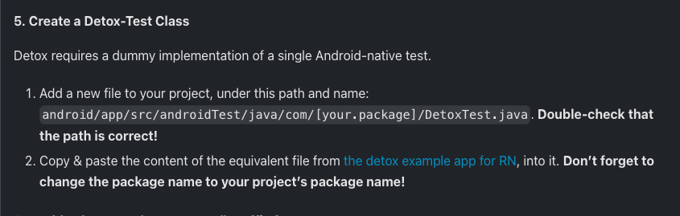
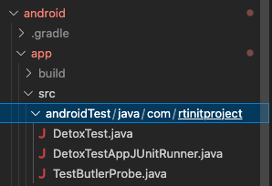

## Environment

| Environment    | Version                        |
| -------------- | ------------------------------ |
| Node           | v16.18.0 (v16.x.x)             |
| Java           | java 11                        |
| Android Studio | Kotlin plugin version - 1.7.20 |

## Setup React Native
> setup at the first time (case never setup it) <br />
> Try to following this instruction https://reactnative.dev/docs/environment-setup <br />
> If it has some issue, let's try this for add on.
```bash
# install watchman
$ brew install watchman

# install cocoapods
$ brew install cocoapods

# install nvm (Node Version Manager)
$ brew install nvm
```

## Setup Detox for Android
### android/build.gradle
> kotlinVersion is depend on Android Studio complie version

```diff
buildscript {
	...
    ext {
        buildToolsVersion = "30.0.2"
        minSdkVersion = 21
        compileSdkVersion = 30
        targetSdkVersion = 30
        ndkVersion = "21.4.7075529"
+       kotlinVersion = '1.7.20'
    }
}

allprojects {
	...
    repositories {
        maven {
            ...  
		}
        maven {
            // All of Detox' artifacts are provided via the npm module
+           url "$rootDir/../e2e/node_modules/detox/Detox-android" <-- need to check path node_modules detox
        }
        google()
	}
}
```

### android/app/build.gradle

> proguardFile "${rootProject.projectDir}/../e2e/node_modules/detox/android/detox/proguard-rules-app.pro" <-- need to check path node_modules detox

```diff
android {
		...
    defaultConfig {
        applicationId "com.rtinitproject"
        minSdkVersion rootProject.ext.minSdkVersion
        targetSdkVersion rootProject.ext.targetSdkVersion
        versionCode 1
        versionName "1.0"

+       testBuildType System.getProperty('testBuildType', 'debug')  // This will later be used to control the test apk build type
+       testInstrumentationRunner 'androidx.test.runner.AndroidJUnitRunner'
    }
		buildTypes {
        debug {
            ...
        }
        release {
            // Caution! In production, you need to generate your own keystore file.
            // see https://reactnative.dev/docs/signed-apk-android.
            signingConfig signingConfigs.debug
            minifyEnabled enableProguardInReleaseBuilds
            proguardFiles getDefaultProguardFile("proguard-android.txt"), "proguard-rules.pro"
+           proguardFile "${rootProject.projectDir}/../e2e/node_modules/detox/android/detox/proguard-rules-app.pro"  <-- need to check path node_modules detox
        }
    }
}

dependencies {
		...
+   androidTestImplementation('com.wix:detox:+')
+   implementation 'androidx.appcompat:appcompat:1.1.0'
+   androidTestImplementation 'com.linkedin.testbutler:test-butler-library:2.2.1'
+   androidTestUtil 'com.linkedin.testbutler:test-butler-app:2.2.1'

```

> on this step it need to add more files (not only DetoxTest.java file)
following these files → https://github.com/wix/Detox/tree/master/examples/demo-react-native/android/app/src/androidTest/java/com/example




> !!! IMPORTANT !!! Don’t forget to change the package name to your project’s package name these files
```
- android/app/src/androidTest/java/com/aio/DetoxTest.java
- android/app/src/androidTest/java/com/aio/DetoxTestAppJUnitRunner.java
- android/app/src/androidTest/java/com/aio/TestButlerProbe.java
```

```
// Replace "com.example" here and below with your app's package name from the top of MainActivity.java
- package com.example;
+ package com.rtinitproject;
```

### android/app/src/main/res/xml/network_security_config.xml
```diff
<?xml version="1.0" encoding="utf-8"?>
<network-security-config>
    <domain-config cleartextTrafficPermitted="true">
        <domain includeSubdomains="true">10.0.2.2</domain>
        <domain includeSubdomains="true">localhost</domain>
    </domain-config>
</network-security-config>
```

### android/app/src/main/AndroidManifest.xml
```diff
<manifest xmlns:android="http://schemas.android.com/apk/res/android"
  package="com.rtinitproject">

    <uses-permission android:name="android.permission.INTERNET" />

    <application
      android:name=".MainApplication"
      android:label="@string/app_name"
      android:icon="@mipmap/ic_launcher"
      android:roundIcon="@mipmap/ic_launcher_round"
      android:allowBackup="false"
+     android:networkSecurityConfig="@xml/network_security_config"
+     android:usesCleartextTraffic="true"
      android:theme="@style/AppTheme">
      <activity
        android:name=".MainActivity"
        android:label="@string/app_name"
        android:configChanges="keyboard|keyboardHidden|orientation|screenSize|uiMode"
        android:launchMode="singleTask"
        android:windowSoftInputMode="adjustResize">
        <intent-filter>
            <action android:name="android.intent.action.MAIN" />
            <category android:name="android.intent.category.LAUNCHER" />
        </intent-filter>
      </activity>
    </application>
</manifest>
```

### Install

```bash
## Install root project
PATH=<root_directory>
$ yarn

## Pod install (for ios)
PATH=<root_directory>/ios
$ cd ios
$ pod deintegrate <- (just for make sure deintegrate before install)
$ pod install

## Install e2e folder
PATH=<root_directory>/e2e
$ cd e2e
$ yarn
```

### Running Detox e2e (IOS)
```bash
PATH=<root_directory>/e2e
$ cd e2e
$ yarn build:ios.debug
$ yarn e2e:iphone.debug
```

### Running Detox e2e (Android)
> !! IMPORTANT !! Should start metro before run test because Android doesn't open metro auto like IOS (When IOS run build it will open metro automatically)

```bash
# start metro
PATH=<root_directory>
$ yarn run start

# run test on Android
PATH=<root_directory>/e2e
$ cd e2e
$ yarn build:android.debug
$ yarn e2e:android.debug
```

## References
* https://github.com/kritnambutt/react-native-v0.67-detox-cucumber
* https://github.com/kritnambutt/react-native-detox-cucumber-simple
* https://wix.github.io/Detox/docs/19.x/introduction/getting-started/
* https://github.com/jaydon-peters/cucumber-detox-demo
* https://medium.com/@peters.jaydon/react-native-detox-and-cucumber-c2164a6eebd5
* https://github.com/mathanpec/react-native-detox-cucumber
* https://github.com/wix/Detox/tree/master/examples/demo-react-native